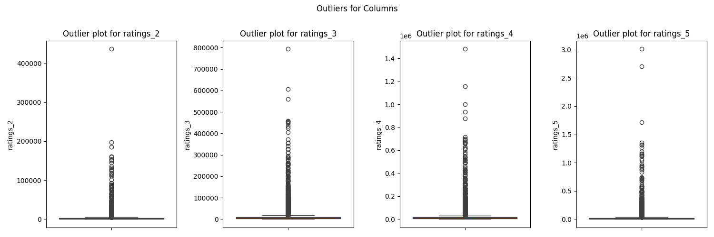

# Goodreads Dataset Analysis 
## Data Description
The dataset consists of information about various books, including their unique identifiers like book_id, goodreads_book_id, and best_book_id. It contains metadata such as the authors, original publication year, titles, and language codes. Additionally, it includes quantitative measures such as average ratings, ratings counts, and a breakdown of ratings from 1 to 5. Other attributes include the number of books in the dataset, ISBN numbers for the books, and URLs for images of the book covers. Overall, this dataset provides a comprehensive overview of the books, their attributes, and user-generated ratings.
## Data Overview
### Summary Statistics
| Stat | book_id | goodreads_book_id | best_book_id | work_id | books_count | isbn13 | original_publication_year | average_rating | ratings_count | work_ratings_count | work_text_reviews_count | ratings_1 | ratings_2 | ratings_3 | ratings_4 | ratings_5 |
| --- | --- | --- | --- | --- | --- | --- | --- | --- | --- | --- | --- | --- | --- | --- | --- | --- |
| count | 10000.000 | 10000.000 | 10000.000 | 10000.000 | 10000.000 | 9415.000 | 9979.000 | 10000.000 | 10000.000 | 10000.000 | 10000.000 | 10000.000 | 10000.000 | 10000.000 | 10000.000 | 10000.000 |
| mean | 5000.500 | 5264696.513 | 5471213.580 | 8646183.425 | 75.713 | 9755044298883.463 | 1981.988 | 4.002 | 54001.235 | 59687.322 | 2919.955 | 1345.041 | 3110.885 | 11475.894 | 19965.697 | 23789.806 |
| std | 2886.896 | 7575461.864 | 7827329.891 | 11751060.824 | 170.471 | 442861920665.573 | 152.577 | 0.254 | 157369.956 | 167803.785 | 6124.378 | 6635.626 | 9717.124 | 28546.449 | 51447.358 | 79768.886 |
| min | 1.000 | 1.000 | 1.000 | 87.000 | 1.000 | 195170342.000 | -1750.000 | 2.470 | 2716.000 | 5510.000 | 3.000 | 11.000 | 30.000 | 323.000 | 750.000 | 754.000 |
| 25% | 2500.750 | 46275.750 | 47911.750 | 1008841.000 | 23.000 | 9780316192995.000 | 1990.000 | 3.850 | 13568.750 | 15438.750 | 694.000 | 196.000 | 656.000 | 3112.000 | 5405.750 | 5334.000 |
| 50% | 5000.500 | 394965.500 | 425123.500 | 2719524.500 | 40.000 | 9780451528640.000 | 2004.000 | 4.020 | 21155.500 | 23832.500 | 1402.000 | 391.000 | 1163.000 | 4894.000 | 8269.500 | 8836.000 |
| 75% | 7500.250 | 9382225.250 | 9636112.500 | 14517748.250 | 67.000 | 9780830777175.000 | 2011.000 | 4.180 | 41053.500 | 45915.000 | 2744.250 | 885.000 | 2353.250 | 9287.000 | 16023.500 | 17304.500 |
| max | 10000.000 | 33288638.000 | 35534230.000 | 56399597.000 | 3455.000 | 9790007672390.000 | 2017.000 | 4.820 | 4780653.000 | 4942365.000 | 155254.000 | 456191.000 | 436802.000 | 793319.000 | 1481305.000 | 3011543.000 |

### Missing Values
| Column | Missing Count | Missing Percentage (%) |
|--------|------------|----------------------|
| book_id | 0.0 | 0.00 |
| goodreads_book_id | 0.0 | 0.00 |
| best_book_id | 0.0 | 0.00 |
| work_id | 0.0 | 0.00 |
| books_count | 0.0 | 0.00 |
| isbn | 700.0 | 7.00 |
| isbn13 | 585.0 | 5.85 |
| authors | 0.0 | 0.00 |
| original_publication_year | 21.0 | 0.21 |
| original_title | 585.0 | 5.85 |
| title | 0.0 | 0.00 |
| language_code | 1084.0 | 10.84 |
| average_rating | 0.0 | 0.00 |
| ratings_count | 0.0 | 0.00 |
| work_ratings_count | 0.0 | 0.00 |
| work_text_reviews_count | 0.0 | 0.00 |
| ratings_1 | 0.0 | 0.00 |
| ratings_2 | 0.0 | 0.00 |
| ratings_3 | 0.0 | 0.00 |
| ratings_4 | 0.0 | 0.00 |
| ratings_5 | 0.0 | 0.00 |
| image_url | 0.0 | 0.00 |
| small_image_url | 0.0 | 0.00 |

Duplicate Rows: 0
## Outliers
|Column|Outlier Count|
|-------|-------|
|book_id|0|
|goodreads_book_id|345|
|best_book_id|357|
|work_id|601|
|books_count|844|
|isbn13|556|
|original_publication_year|1031|
|average_rating|158|
|ratings_count|1163|
|work_ratings_count|1143|
|work_text_reviews_count|1005|
|ratings_1|1140|
|ratings_2|1156|
|ratings_3|1149|
|ratings_4|1131|
|ratings_5|1158|

 
## Correlation Heatmap

## Data Story
In analyzing a dataset comprised of 10,000 books, we uncover a rich tapestry of literary engagement and reader preferences. The collection showcases a wide range of original publication years, with a staggering mean year of publication around 1981, suggesting that while newer titles enter the fray, works from the latter part of the 20th century still hold considerable sway among readers.

Diving deeper, we notice that the books have an average rating of 4.00, indicating a generally favorable reception. This high average is supported by the substantial number of ratings each book receives, with a mean of approximately 54,001 across all titles. Interestingly, there are outliers in the dataset, with some books commanding up to 4,780,653 ratings, illustrating the phenomenon of certain works resonating powerfully within the community.

The ratings breakdown further supports this narrative, with the highest number of perfect ratings (5 stars) averaging around 23,790, suggesting that when readers are truly captivated, their enthusiasm is profound. This is complemented by the near-even distribution of lower rating bands, hinting at a diverse range of opinions and experiences among readers.

Moreover, the dataset reflects the breadth of readership; while the average book count per entry is about 75, some users boast collections as large as 3,455 books. This highlights the passionate engagement of readers who not only consume literature but actively participate in the evaluation and discussion of their reads.

In summary, this dataset unveils a literary landscape where older publications retain relevance, books are generally well-received, and enthusiastic readers contribute to a vibrant community of sharing and discussion. The numbers tell a story of dedication, diversity, and a love for reading that transcends years and genres.
