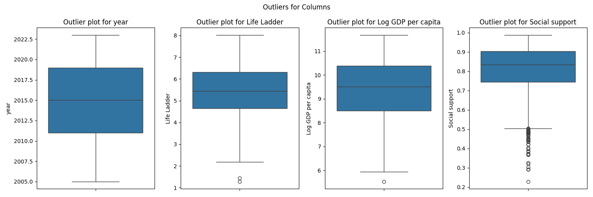

# Happiness Dataset Analysis 
## Data Description
The dataset consists of various indicators related to well-being and quality of life across different countries and years. The 'Country name' column identifies the country for each row of data. The 'year' column specifies the time period for the recorded metrics. 'Life Ladder' is likely a measure of subjective well-being or happiness. 'Log GDP per capita' reflects the economic performance of a country on a per-person basis, adjusted for inflation. 'Social support' indicates the perceived availability of supportive social networks. 'Healthy life expectancy at birth' measures the average number of years a newborn is expected to live in good health. Indicators like 'Freedom to make life choices' and 'Generosity' assess individual freedoms and altruistic behavior, while 'Perceptions of corruption' reflects trust in government and institutions. Lastly, 'Positive affect' and 'Negative affect' gauge emotional experiences, contributing to an overall picture of well-being in the context of social, economic, and psychological factors. The dataset can be useful for analyzing trends in happiness and quality of life across different regions and times.
## Data Overview
### Summary Statistics
| Stat | year | Life Ladder | Log GDP per capita | Social support | Healthy life expectancy at birth | Freedom to make life choices | Generosity | Perceptions of corruption | Positive affect | Negative affect |
| --- | --- | --- | --- | --- | --- | --- | --- | --- | --- | --- |
| count | 2363.000 | 2363.000 | 2335.000 | 2350.000 | 2300.000 | 2327.000 | 2282.000 | 2238.000 | 2339.000 | 2347.000 |
| mean | 2014.764 | 5.484 | 9.400 | 0.809 | 63.402 | 0.750 | 0.000 | 0.744 | 0.652 | 0.273 |
| std | 5.059 | 1.126 | 1.152 | 0.121 | 6.843 | 0.139 | 0.161 | 0.185 | 0.106 | 0.087 |
| min | 2005.000 | 1.281 | 5.527 | 0.228 | 6.720 | 0.228 | -0.340 | 0.035 | 0.179 | 0.083 |
| 25% | 2011.000 | 4.647 | 8.506 | 0.744 | 59.195 | 0.661 | -0.112 | 0.687 | 0.572 | 0.209 |
| 50% | 2015.000 | 5.449 | 9.503 | 0.835 | 65.100 | 0.771 | -0.022 | 0.798 | 0.663 | 0.262 |
| 75% | 2019.000 | 6.324 | 10.393 | 0.904 | 68.552 | 0.862 | 0.094 | 0.868 | 0.737 | 0.326 |
| max | 2023.000 | 8.019 | 11.676 | 0.987 | 74.600 | 0.985 | 0.700 | 0.983 | 0.884 | 0.705 |

### Missing Values
| Column | Missing Count | Missing Percentage (%) |
|--------|------------|----------------------|
| Country name | 0.0 | 0.00 |
| year | 0.0 | 0.00 |
| Life Ladder | 0.0 | 0.00 |
| Log GDP per capita | 28.0 | 1.18 |
| Social support | 13.0 | 0.55 |
| Healthy life expectancy at birth | 63.0 | 2.67 |
| Freedom to make life choices | 36.0 | 1.52 |
| Generosity | 81.0 | 3.43 |
| Perceptions of corruption | 125.0 | 5.29 |
| Positive affect | 24.0 | 1.02 |
| Negative affect | 16.0 | 0.68 |

Duplicate Rows: 0
## Outliers
|Column|Outlier Count|
|-------|-------|
|year|0|
|Life Ladder|2|
|Log GDP per capita|1|
|Social support|48|
|Healthy life expectancy at birth|20|
|Freedom to make life choices|16|
|Generosity|39|
|Perceptions of corruption|194|
|Positive affect|9|
|Negative affect|31|

 
## Correlation Heatmap

## Analysis Recommendations
Certainly! Here are 10 analysis recommendations that a data analyst could perform to gain insights from the provided dataset:

1. **Descriptive Statistics**: Start with calculating the mean, median, standard deviation, and range for all numerical variables (e.g., Life Ladder, Log GDP per capita). This will provide an overview of the data distribution.

2. **Correlation Analysis**: Determine the correlation between various factors (e.g., Life Ladder, Log GDP per capita, and Social support) to identify relationships and potential predictors of life satisfaction.

3. **Time Series Analysis**: Analyze trends over the years for each country to see how the Life Ladder and other variables have changed over time. This can be performed using line plots.

4. **Comparative Analysis**: Compare the Life Ladder across different countries or regions to identify which countries score higher or lower, and explore possible reasons behind these differences (e.g., socioeconomic factors).

5. **Group By Analysis**: Use group-by functionality to analyze the average Life Ladder score based on categorical features such as country or year, to find insights into how these categories impact life satisfaction.

6. **Regression Analysis**: Conduct linear regression to explore how factors like Log GDP per capita, Social support, and Freedom to make life choices predict the Life Ladder score.

7. **Heatmaps**: Create heatmaps to visualize the correlations between different attributes to identify any strong relationships visually among numerical variables.

8. **ANOVA Tests**: If there are distinct groups/categories (e.g., different regions), perform ANOVA tests to see if there are statistically significant differences in Life Ladder scores between these groups.

9. **Cluster Analysis**: Use clustering techniques (e.g., K-means) to segment countries based on similar characteristics, which could help to identify groups with similar life qualities or socioeconomic factors.

10. **Sentiment/Feature Analysis**: Based on Positive affect and Negative affect, analyze how emotional well-being relates to life satisfaction and what factors contribute to these feelings across different demographics or regions.

These analyses would provide a comprehensive understanding of how various factors influence life satisfaction and allow the analyst to derive meaningful insights from the dataset.
## Data Story
In exploring the dataset that spans from 2005 to 2023, we uncover a rich tapestry of insights tied to well-being and societal factors across various regions. The average Life Ladder score, which reflects overall life satisfaction, stands at approximately 5.48, suggesting that while many individuals report a moderate sense of well-being, there is significant variability, with scores ranging from a low of 1.28 to a high of 8.02. This variability indicates divergent experiences of quality of life. 

Looking at economic prosperity, measured by Log GDP per capita, the average value of about 9.40 correlates with life satisfaction; however, the range from 5.53 to 11.68 reveals stark economic disparities across nations. Higher economic metrics often correspond with improved quality of life as indicated by a positive relationship between GDP and life satisfaction.

Social support emerges as a crucial determinant of well-being, with the average score being 0.81. Strong social networks appear to enhance life satisfaction, highlighting the importance of community and interpersonal relationships. Additionally, the 'Freedom to make life choices' score, averaging 0.75, underscores how personal freedom contributes to a sense of control and fulfillment in life.

Healthy life expectancy stands at approximately 63.4 years, which, while promising, suggests room for improvement in health systems worldwide. The data reveals discrepancies in health outcomes that align with economic and social factors.

Generosity and perceptions of corruption present a dual perspective on societal trust and altruism, with generosity averaging close to zero, indicating a general tendency toward self-interest, whereas perceptions of corruption average around 0.74. This suggests that many individuals feel corruption is a significant issue, potentially impacting trust in socio-economic systems.

Moreover, the emotional landscape is captured through measures of positive and negative affect. On average, individuals report a positive affect score of 0.65, yet negative affect, with an average of 0.27, indicates that while many experience positive emotions, a notable portion of the population grapples with negative feelings. 

In conclusion, this dataset not only reveals the average sentiments around life satisfaction but also highlights the multifaceted nature of well-being. A complex interplay between economic conditions, social structures, health, freedom, and emotional experiences shapes people's lives around the globe, offering a poignant reminder of the diverse factors that influence human happiness.
