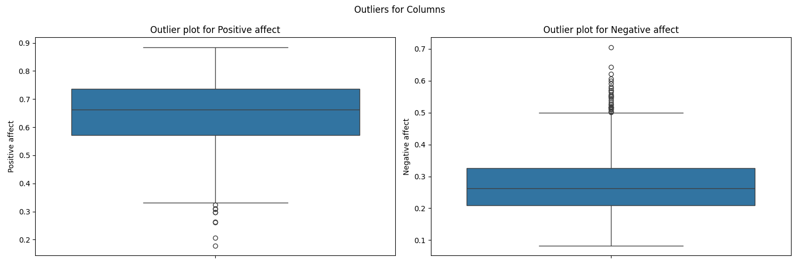
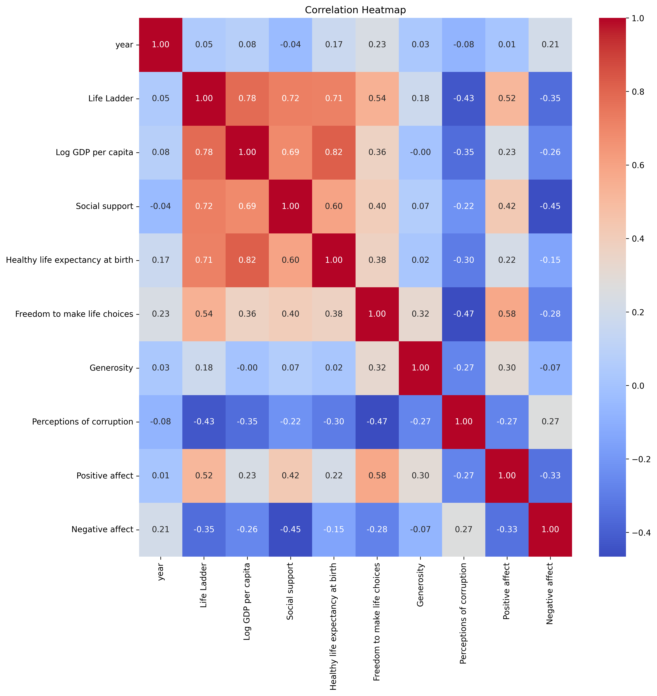

# Happiness Dataset Analysis 
## Data Description
The dataset consists of various countries and their respective data for different years. It includes a measure known as the "Life Ladder," which likely assesses subjective well-being or happiness. Other columns capture economic and social indicators, such as "Log GDP per capita," which indicates the economic status of each country, and "Social support," reflecting community and societal contributions to well-being. Additionally, it includes health metrics like "Healthy life expectancy at birth." Factors influencing personal freedom and societal perceptions, such as "Freedom to make life choices," "Generosity," and "Perceptions of corruption," are also present. Lastly, the dataset features columns for emotional indicators, represented by "Positive affect" and "Negative affect," which provide insights into the overall psychological well-being of the population in each country and year. Overall, this dataset is geared towards analyzing the relationship between various factors and overall life satisfaction across different nations and time periods.
## Data Overview
### Summary Statistics
| Stat | year | Life Ladder | Log GDP per capita | Social support | Healthy life expectancy at birth | Freedom to make life choices | Generosity | Perceptions of corruption | Positive affect | Negative affect |
| --- | --- | --- | --- | --- | --- | --- | --- | --- | --- | --- |
| count | 2363.000 | 2363.000 | 2335.000 | 2350.000 | 2300.000 | 2327.000 | 2282.000 | 2238.000 | 2339.000 | 2347.000 |
| mean | 2014.764 | 5.484 | 9.400 | 0.809 | 63.402 | 0.750 | 0.000 | 0.744 | 0.652 | 0.273 |
| std | 5.059 | 1.126 | 1.152 | 0.121 | 6.843 | 0.139 | 0.161 | 0.185 | 0.106 | 0.087 |
| min | 2005.000 | 1.281 | 5.527 | 0.228 | 6.720 | 0.228 | -0.340 | 0.035 | 0.179 | 0.083 |
| 25% | 2011.000 | 4.647 | 8.506 | 0.744 | 59.195 | 0.661 | -0.112 | 0.687 | 0.572 | 0.209 |
| 50% | 2015.000 | 5.449 | 9.503 | 0.835 | 65.100 | 0.771 | -0.022 | 0.798 | 0.663 | 0.262 |
| 75% | 2019.000 | 6.324 | 10.393 | 0.904 | 68.552 | 0.862 | 0.094 | 0.868 | 0.737 | 0.326 |
| max | 2023.000 | 8.019 | 11.676 | 0.987 | 74.600 | 0.985 | 0.700 | 0.983 | 0.884 | 0.705 |

### Missing Values
| Column | Missing Count | Missing Percentage (%) |
|--------|------------|----------------------|
| Country name | 0.0 | 0.00 |
| year | 0.0 | 0.00 |
| Life Ladder | 0.0 | 0.00 |
| Log GDP per capita | 28.0 | 1.18 |
| Social support | 13.0 | 0.55 |
| Healthy life expectancy at birth | 63.0 | 2.67 |
| Freedom to make life choices | 36.0 | 1.52 |
| Generosity | 81.0 | 3.43 |
| Perceptions of corruption | 125.0 | 5.29 |
| Positive affect | 24.0 | 1.02 |
| Negative affect | 16.0 | 0.68 |

Duplicate Rows: 0
## Outliers
|Column|Outlier Count|
|-------|-------|
|year|0|
|Life Ladder|2|
|Log GDP per capita|1|
|Social support|48|
|Healthy life expectancy at birth|20|
|Freedom to make life choices|16|
|Generosity|39|
|Perceptions of corruption|194|
|Positive affect|9|
|Negative affect|31|

 
## Correlation Heatmap

## Analysis Recommendations
To gain meaningful insights from the dataset with the provided summary statistics, the data analyst can conduct a variety of analyses. Here are 10 recommendations:

1. **Correlation Analysis**: Examine the correlation between the variables, particularly between 'Life Ladder' and other factors such as 'Log GDP per capita', 'Social support', and 'Healthy life expectancy'. This can help identify which factors most strongly relate to life satisfaction.

2. **Regression Analysis**: Perform multiple regression analysis to understand the predictive power of different variables (e.g., 'Log GDP per capita', 'Social support') on 'Life Ladder'. This can help quantify the strength and direction of relationships.

3. **Trend Analysis by Year**: Analyze how the 'Life Ladder' scores have changed over the years. This can involve visualizing trends over time using line plots, which might reveal significant improvements or declines in life satisfaction.

4. **Country Comparisons**: Compare averages of key metrics (e.g., 'Life Ladder', 'Log GDP per capita') across countries to understand which countries perform better or worse and may provide insights into socio-economic status.

5. **Cluster Analysis**: Implement clustering techniques (like K-means or hierarchical clustering) to group countries with similar profiles based on the various indicators. This can identify patterns or forms of groupings among the countries.

6. **Impact of Freedom and Generosity**: Investigate how 'Freedom to make life choices' and 'Generosity' contribute to well-being as measured by 'Life Ladder'. This could involve focused correlation or regression analyses on these variables.

7. **Life Ladder Segmentation**: Create segments of countries based on 'Life Ladder' scores (e.g., low, medium, high) and analyze the characteristics of each segment to identify key determinants of higher satisfaction.

8. **Sentiment Analysis**: If applicable, incorporate qualitative data or open responses related to life satisfaction and add a qualitative analysis to complement numerical data insights.

9. **Visualizations**: Use data visualization tools to create dashboards that showcase the relationships among the variables, such as scatter plots, heat maps, and bar charts, making the findings more accessible.

10. **Geospatial Analysis**: If latitude and longitude data is available, perform geospatial analysis to visualize the relationships of life satisfaction with geographical factors, identifying regional trends or anomalies.

These analyses, alone or combined, can provide comprehensive insights into the factors influencing life satisfaction across different countries and years, guiding policy recommendations or further research directions.
## Data Story
In a comprehensive analysis of well-being across multiple dimensions from 2005 to 2023, we examined a dataset of 2363 observations that reveals intriguing patterns in life satisfaction, economic conditions, and social factors. The 'Life Ladder', a key indicator of subjective well-being, averaged at 5.48 on a scale where higher values indicate greater life satisfaction. Although the mean score suggests moderate well-being, there is considerable variation, as evidenced by a standard deviation of 1.13 and a minimum value of just 1.28, highlighting a significant disparity in life satisfaction across different populations.

Economic factors are also crucial in understanding life satisfaction. The 'Log GDP per capita' indicates an average economic output per person at 9.40, with an impressive maximum of 11.68 suggesting that wealthier nations likely report higher life satisfaction levels. This is supported by the relationship between economic prosperity and social support, which has a high average score of 0.81. However, with a minimum of 0.23, some individuals lack adequate social support, impacting their overall well-being.

Health, represented by 'Healthy life expectancy at birth' with a mean of 63.4 years, exemplifies the importance of longevity in life satisfaction. Here too, we see a spread, with some regions having life expectancies as low as 6.72 years, reflecting potential health crises or systemic issues that need addressing.

The dimension of freedom to make life choices is encapsulated in an average score of 0.75, demonstrating a moderate sense of autonomy among the population, yet indicating that the freedom to make life choices is not universally accessible. Coupled with perceptions of corruption at an average of 0.74, these statistics indicate that societal structures play a significant role in shaping individual experiences of happiness and freedom.

Another noteworthy aspect of the data is the measure of 'Generosity', which surprisingly has a mean close to zero (0.0001), suggesting that societal giving may not be as pronounced as one might hope. Meanwhile, 'Positive affect' averaged 0.65, indicating that most individuals maintain a positive outlook on life, although this is balanced against a negative affect average of 0.27, revealing the complexity of emotional well-being.

Overall, this dataset paints a multifaceted portrait of well-being, suggesting that while certain areas like social support and economic factors show positive trends, significant disparities and challenges remain. The interplay between economic stability, social factors, health, and individual freedoms creates a rich tapestry of experiences and implications for policy and social initiatives aimed at enhancing life satisfaction.
