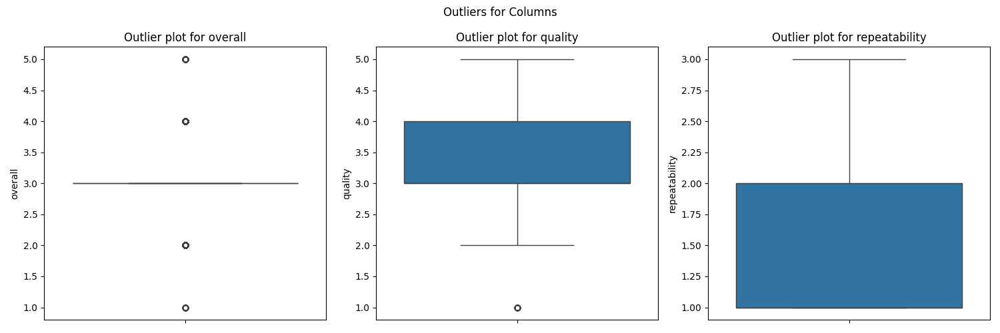

# Media Dataset Analysis 
## Data Description
The dataset consists of several attributes related to textual or content analysis. The 'date' column likely represents the date of creation or publication, while 'language' may indicate the language of the content. The 'type' column could categorize the content, such as articles, reviews, or posts. The 'title' column presents the title of the content, and 'by' probably identifies the author or creator of the work. The 'overall' column might provide an aggregated score or rating relating to the content's quality or performance. The 'quality' column likely assesses specific quality characteristics of the content, and 'repeatability' may measure how similar content can be generated or replicated. Overall, the dataset appears focused on evaluating and analyzing different aspects of content across various attributes.
## Data Overview
### Summary Statistics
| Stat | overall | quality | repeatability |
| --- | --- | --- | --- |
| count | 2652.000 | 2652.000 | 2652.000 |
| mean | 3.048 | 3.209 | 1.495 |
| std | 0.762 | 0.797 | 0.598 |
| min | 1.000 | 1.000 | 1.000 |
| 25% | 3.000 | 3.000 | 1.000 |
| 50% | 3.000 | 3.000 | 1.000 |
| 75% | 3.000 | 4.000 | 2.000 |
| max | 5.000 | 5.000 | 3.000 |

### Missing Values
| Column | Missing Count | Missing Percentage (%) |
|--------|------------|----------------------|
| date | 99.0 | 3.73 |
| language | 0.0 | 0.00 |
| type | 0.0 | 0.00 |
| title | 0.0 | 0.00 |
| by | 262.0 | 9.88 |
| overall | 0.0 | 0.00 |
| quality | 0.0 | 0.00 |
| repeatability | 0.0 | 0.00 |

Duplicate Rows: 1
## Outliers
|Column|Outlier Count|
|-------|-------|
|overall|1216|
|quality|24|
|repeatability|0|

 
## Correlation Heatmap

## Analysis Recommendations
To gain insights from the dataset with the provided summary statistics, the data analyst can perform the following analyses:

1. **Time Series Analysis**: Analyze trends over time by aggregating data based on the 'date' field to observe patterns, seasonality, or changes in metrics such as 'overall' rating.

2. **Language Popularity Analysis**: Examine the 'language' field to determine which languages are most prevalent in the dataset and how they relate to quality and overall ratings.

3. **Type Comparison**: Explore differences in ratings or quality based on the 'type' of entries (e.g., articles, videos, etc.), potentially using box plots to visualize the distributions.

4. **Sentiment Analysis Based on Titles**: Perform sentiment analysis on the 'title' field to identify whether the sentiment correlates with ratings of 'overall' and 'quality'.

5. **User Contribution Analysis**: Analyze the 'by' field to find out which contributors are associated with higher ratings, and investigate their contribution volume versus quality.

6. **Correlation Analysis**: Compute correlation coefficients between 'overall', 'quality', and 'repeatability' to understand relationships between these variables.

7. **Quality Rating Distribution**: Visualize the distribution of the 'quality' ratings through histograms or density plots to identify skewness or outliers in data.

8. **Grouped Statistics**: Group the data by 'language' or 'type' and calculate aggregate statistics (mean, median) for 'overall' and 'quality' ratings to identify standout groups.

9. **Repeatability Assessment**: Analyze 'repeatability' ratings against 'quality' and 'overall' to determine if there is a significant relationship, possibly through regression analysis.

10. **Text Analysis of Titles**: Use techniques such as word frequency analysis or topic modeling on the 'title' field to identify common themes or keywords that predict higher ratings.

By conducting these analyses, the data analyst can extract valuable insights and understand the underlying trends, relationships, and characteristics within the dataset.
## Data Story
In analyzing a dataset of 2652 observations, a compelling narrative unfolds regarding the subjects' overall experiences, perceived quality, and repeatability metrics. The overall mean rating stands at approximately 3.05, indicating a slight tendency towards favorable responses, although the level of satisfaction is somewhat muted. This is mirrored in the quality metrics, where the mean score is slightly higher at about 3.21, showcasing that while respondents generally hold a positive view of quality, it still reflects a mixed landscape filled with varying levels of satisfaction.

Diving deeper, we observe consistency in the data, with 75% of the respondents rating the overall experience between 3 and 5, suggesting that a majority find value in what is being assessed. However, the presence of outliers at the lower end—like the recorded minimum of 1—indicates that there are significant dissenting opinions, driving important considerations for improvement.

Contrastingly, repeatability scores present a different story; the mean sits at approximately 1.49, indicating that just about half of the respondents acknowledge even a modest level of repeatability in their experiences. The data reveals that a staggering 75% of the individuals rated repeatability as 1 or 2, suggesting that many do not foresee themselves engaging with the offering again. This raises critical questions about sustainability and long-term engagement for the subjects involved.

In conclusion, while there is a foundation of positive perceptions regarding overall experiences and quality, the stark results concerning repeatability unveil a challenge that demands attention. Understanding the factors contributing to these sentiments could hold the key to enhancing future interactions and fostering lasting relationships with the audience.
