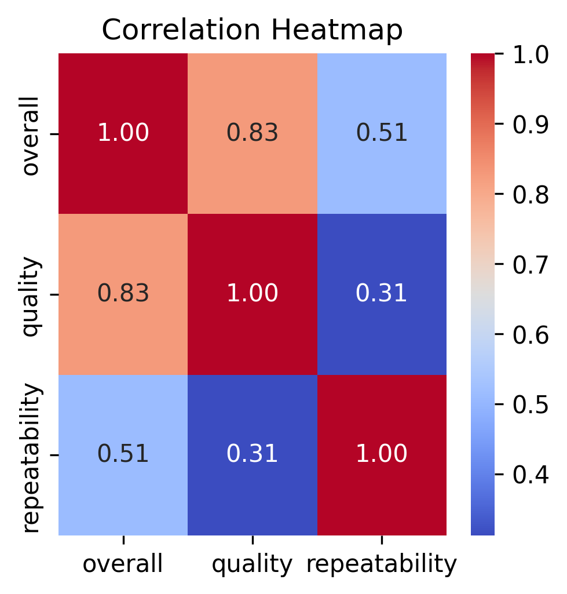

# Media Dataset Analysis 
## Data Description
The dataset consists of various attributes related to documents or items, likely reviews or articles, as indicated by the column names. The 'date' column likely records when each entry was created or published. The 'language' column indicates the language in which the document is written. The 'type' column might categorize the documents based on their nature or genre. The 'title' column contains the names of the entries, while the 'by' column likely specifies the author or creator of the content. The 'overall' column could represent a general rating or evaluation of the document, and the 'quality' column might assess the standard or excellence of the content. Lastly, the 'repeatability' column may measure how often the content can be replicated or the consistency of its quality across different contexts. Together, these columns provide a comprehensive overview of the characteristics and quality of each entry within the dataset.
## Data Overview
### Summary Statistics
| Stat | overall | quality | repeatability |
| --- | --- | --- | --- |
| count | 2652.000 | 2652.000 | 2652.000 |
| mean | 3.048 | 3.209 | 1.495 |
| std | 0.762 | 0.797 | 0.598 |
| min | 1.000 | 1.000 | 1.000 |
| 25% | 3.000 | 3.000 | 1.000 |
| 50% | 3.000 | 3.000 | 1.000 |
| 75% | 3.000 | 4.000 | 2.000 |
| max | 5.000 | 5.000 | 3.000 |

### Missing Values
| Column | Missing Count | Missing Percentage (%) |
|--------|------------|----------------------|
| date | 99.0 | 3.73 |
| language | 0.0 | 0.00 |
| type | 0.0 | 0.00 |
| title | 0.0 | 0.00 |
| by | 262.0 | 9.88 |
| overall | 0.0 | 0.00 |
| quality | 0.0 | 0.00 |
| repeatability | 0.0 | 0.00 |

Duplicate Rows: 1
## Outliers
|Column|Outlier Count|
|-------|-------|
|overall|1216|
|quality|24|
|repeatability|0|

 
## Correlation Heatmap

## Analysis Recommendations
Here are 10 analysis recommendations for the data analyst based on the provided summary statistics:

1. **Time Series Analysis**:
   - Analyze trends over time by plotting the 'date' variable to identify patterns in 'overall' ratings or 'quality' scores over specific periods (daily, monthly, etc.).

2. **Language Distribution**:
   - Examine the distribution of 'language' categories within the dataset to understand which languages are most common. This could involve visualizations like pie charts or bar graphs.

3. **Type Analysis**:
   - Analyze the different 'type' categories (e.g., articles, videos, etc.) to determine if certain types are associated with higher 'overall' or 'quality' scores. Compare their average ratings using box plots.

4. **Correlation Analysis**:
   - Investigate the correlations between numerical variables (e.g., 'overall', 'quality', and 'repeatability') to understand how these metrics interact with each other.

5. **Top Performers**:
   - Identify the 'title' or content that received the highest 'overall' and 'quality' ratings. Create a leaderboard or ranking table to highlight top-performing content.

6. **Quality vs. Repeatability**:
   - Analyze the relationship between 'quality' and 'repeatability' scores to see if there are any trends; for instance, do more 'repeatable' items also have higher 'quality' scores?

7. **Grouping by Language and Type**:
   - Conduct a grouped analysis on 'overall' ratings by 'language' and 'type' to identify which combinations yield the best scores.

8. **Sentiment Analysis (if applicable)**:
   - If there are text responses or comments associated with the 'title' or 'by' fields, perform sentiment analysis to gauge the overall sentiment towards different content types.

9. **Outlier Detection**:
   - Investigate outliers in 'overall', 'quality', and 'repeatability' metrics to identify any unusual data points that could represent exceptional or poor performance.

10. **User Contributions**:
    - Analyze the 'by' variable to assess the contributions of different users/authors. Determine if some contributors consistently earn higher ratings than others, perhaps revealing expert contributors or popular content creators.

By applying these analyses, the data analyst can uncover valuable insights regarding the dataset and its trends, patterns, and relationships.
## Data Story
In our analysis of a dataset comprising 2,652 entries, we uncover intriguing insights regarding the overall performance, quality, and repeatability of the measured variables. 

Starting with the overall metric, the mean score stands at approximately 3.05, indicating a moderately favorable perception amongst the respondents. The data reveals that the majority of entries cluster around the values of 3, with 75% of scores at or below this threshold. Notably, the distribution demonstrates minimal variance, with a standard deviation of 0.76, suggesting that respondents share similar views. However, the highest score of 5 highlights that there are indeed high achievers within this group.

When we turn our attention to quality, we see a slightly higher mean of about 3.21, suggesting that participants feel that quality is somewhat better than the overall assessment. The quality scores show a similar pattern of concentration, with a distinct quarter of respondents giving it the highest possible rating of 5. The standard deviation of approximately 0.80 indicates a bit more variability compared to the overall metric, which may suggest differing experiences or expectations regarding quality.

Conversely, the repeatability metric offers a stark contrast. Here, the average score of 1.49 indicates a general dissatisfaction or challenge regarding how repeatable the measured outcomes are. The majority of respondents—75%—rated repeatability at or below 1, indicating significant concerns. With a standard deviation of 0.60, the scores for repeatability are less spread out but concentrated at the lower end of the scale, suggesting that while some individuals may have experienced better repeatability, the overwhelming trend indicates a pressing issue.

Together, these statistics tell a compelling story: while respondents feel moderately positive about overall performance and quality, there is a critical need to address the concerns relating to repeatability. This could signify underlying problems that merit our attention and could ultimately enhance user satisfaction and trust in the measured variables. The focus on improving repeatability could lead to a more consistent and reliable experience for all stakeholders involved.
